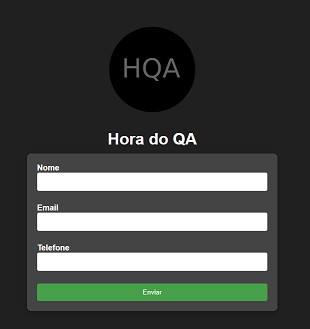
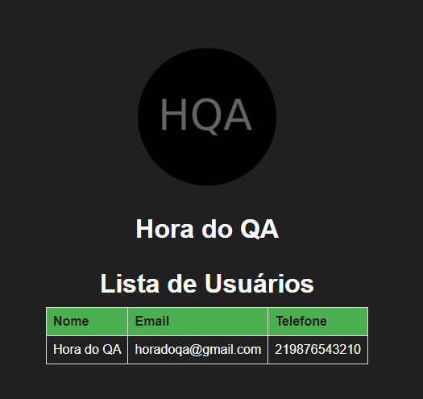

# Hora do QA

Página de cadastro que obtem os dados (nome completo, e-mail e telefone) e salva em um banco de dados.

## Cadastro

## Os dados são exibidos em uma página `/usuarios`

## Índice

- [Introdução](#introdução)
- [Pré-requisitos](#pré-requisitos)
- [Passos para configuração](#passos-para-configuração)
- [Criar uma aplicação com React](#)
- [Criar o BE](#criar-uma-aplicação-com-React)
- [Criar o banco PostgreSQL](#criar-o-banco-PostgreSQL)
- [Criar imagens com Docker e subir para o Docker Hub](#Criar-imagens-com-Docker-e-subir-para-o-DockerHub)
- [Executando o projeto](#executando-o-projeto)
- [Contribuição](#contribuição)
- [Licença](#licença)

## Introdução
Este projeto é uma aplicação que utiliza React no front-end e uma API desenvolvida em [tecnologia do backend]. Ele se conecta a um banco de dados PostgreSQL e é containerizado com Docker para facilitar a implementação e a escalabilidade.

## Pré-requisitos
Antes de começar, verifique se você tem os seguintes softwares instalados:

- Node.js
- Docker
- PostgreSQL

## Passos para configuração
Siga os passos abaixo para configurar e executar o projeto:

### Criar uma aplicação com React
Neste passo, você irá configurar a estrutura básica da sua aplicação React.

- [Criar uma aplicação com React](./docs/react.md)

### Criar o BE
Aqui, você criará a API do backend para interagir com o front-end e o banco de dados.

- [Criar o BE](./docs/be.md)

### Criar o banco PostgreSQL
Configure o banco de dados PostgreSQL necessário para armazenar os dados da sua aplicação.

- [Criar o banco PostgreSQl](./docs/postgresql.md)

### Criar imagens com Docker e subir para o Docker Hub
Neste passo, você irá containerizar sua aplicação e enviá-la para o Docker Hub.

- [Criar imagens com Docker e subir para o dockerhub](./docs/docker.md)

### Executando o projeto
Por fim, siga as instruções para executar sua aplicação localmente.

- [Executando o projeto](./docs/setup.md)

## Contribuição
Contribuições são bem-vindas! Sinta-se à vontade para abrir um problema ou enviar um pull request.

## Licença
Este projeto está licenciado sob a [Nome da Licença]. Veja o arquivo LICENSE para mais detalhes.
